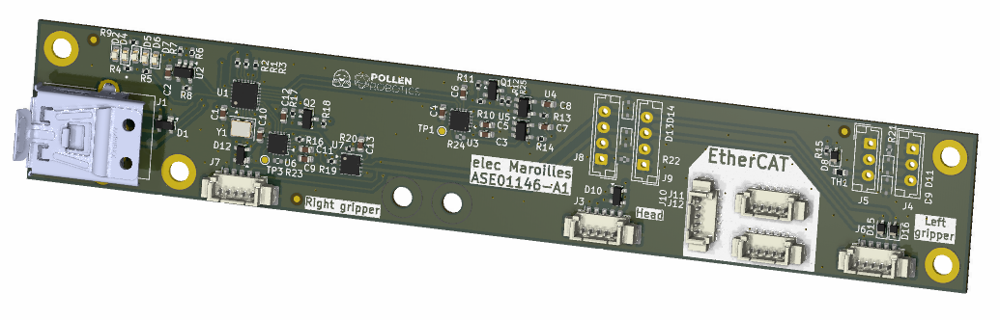

# "Maroilles" Electronic Board

"elec_maroilles" is USB 2.0 hub built with lockable USB connectors. It provides also Dynamixel TTL and Dynamixel RS485 converters and the associated connectors for Reachy 2's grippers and antennas.

## Basically
 - Designed with KiCAD 9.
